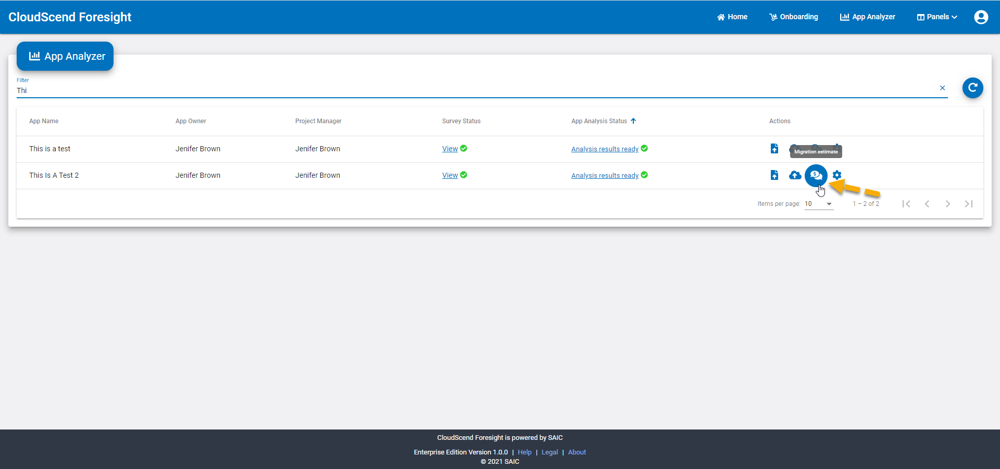

# Managing Your Applications

Once you have logged into CloudScend Foresight, you will be presented with the CloudScend Foresight home page. From the CloudScend Foresight home page you can select what actions you would like to perform. You can choose the following:

- Add new applications through [Onboarding](#onboarding) tasks.
- View your application portfolio dashboards from the [App Portfolio](#app-portfolio)
- Upload source code, artifacts, enter surveys and run migration estimates from the [App Analyzer](#app-analyzer)
- Learn more about your application's code health and technical debt over the course of their lifetime through [Continuous Assessment](#continuous-assessment)
- Perform data mining on your own to answer questions about your app portfolio using our [Knowledge Discovery](#knowledge-discovery) option.


## Onboarding

To add applications to your portfolio and to be able to start using the CloudScend Foresight product, you will need to first onboard your application(s).

### Application Onboarding

Follow these easy steps below to complete your application onboarding.

**1. Select either the Onboarding link on the CloudScend Foresight home screen or the Onboarding link located on the main menu bar.**


<br></br>

The Onboarding Page allows you to enter all the basic information for setting up your application within CloudScend Foresight.

<br></br>

:::note

The Application Name, acronym, organization name, and application owner are all required fields.

:::


<br></br>

**2. Enter your application name, its acronym, your organization name and optionally your sub-organization name.**


<br></br>

**3. Enter the Application Owner information (required) and any other applicable personnel fields. Note that for any name fields, the individual must have an account on CloudScend Foresight and their email will be populated based on their account information.**


<br></br>

**4. Select Submit at the bottom of the page to proceed.**


<br></br>

Once you have submitted your application for onboarding, you will be offered the option to continue on to complete your survey.
:::note

It is common to complete your survey following onboarding your application. While completing the survey is required to analyze your application, it doesn't have to be done immediately following onboarding so you may choose to postpone this step.

:::

**5. Make your selection to complete the survey by selecting the Start Survey button. Optionally, you can choose the Take Later button to postpone completing the survey and you will be taken back to the home screen. However, please note, that you must complete the survey before any application processing will be performed.**


Once you have selected the Complete Survey button, you will be taken to the Survey Window. Please see the [Survey Management](#survey-management) section of this guide for step by step instructions on filling out your survey.

### Survey Management

In order to provide you with the most accurate cloud readiness analysis, you need to complete a short survey with questions regarding your application and its dependencies and interfaces as well as questions regarding the business impact of your application. Please be sure to provide the most accurate information as possible as incorrect answers can affect your output.

#### Survey Question Details

The table below provides you with the survey questions and possible answers so you can prepare to provide the most accurate answers possible for your application.

**Technical Assessment Questions**

| Survey Question                                                                                                            | Possible Answers                                                                                              |
| -------------------------------------------------------------------------------------------------------------------------- | ------------------------------------------------------------------------------------------------------------- |
| What is the system type                                                                                                    | Legacy System<br></br>Cloud System                                                                            |
| What is the architecture of the system?                                                                                    | Web System (n-Tier)<br></br>Thick Client System<br></br>Mainframe System                                      |
| How many HTTPS-based/443 interface does the system use with external systems?                                              | 0-50                                                                                                          |
| How many non HTTPS-based/443 interface does the system use (e.g., TCP, UDP, SMTP) with external systems?                   | 0-50                                                                                                          |
| What is the primary database type for this system?                                                                         | Self-Managed (MySQL, Postgres, Oracle, etc)<br></br>CSP Managed (AWS RDS, Azure SQL, etc)<br></br>No Database |
| How many primary databases are associated with this system?                                                                | 0-20                                                                                                          |
| What primary database components are used for this system?                                                                 | DB Links<br></br>Stored Procs<br></br>Both<br></br>None                                                       |
| What is the secondary database type for this system?                                                                       | Self-Managed (MySQL, Postgres, Oracle, etc)<br></br>CSP Managed (AWS RDS, Azure SQL, etc)<br></br>No Database |
| How many secondary databases are associated with this system?                                                              | 0-20                                                                                                          |
| What secondary database components are used for this system?                                                               | DB Links<br></br>Stored Procs<br></br>Both<br></br>None                                                       |
| Does this system integrate with a CAC/PIV for user authentication?                                                         | Yes<br></br>No                                                                                                |
| What Single Sign-On token does the system use?                                                                             | SAML<br></br>OIDC/JWT<br></br>Other                                                                           |
| Does the system use Shared Filesystems or Shared Caching?                                                                  | Yes<br></br>No                                                                                                |
| Does this system use messaging based products (e.g. MQSeries, RabbitMQ)?                                                   | Yes<br></br>No                                                                                                |
| Does this system have a need for real-time data synchronization?                                                           | Yes<br></br>No                                                                                                |
| Does this system use ERP that must be migrated to cloud with the system?                                                   | Yes<br></br>No                                                                                                |
| Does this system use other 3rd party software that must be migrated to cloud with the system (COTS, open source software)? | Yes<br></br>No                                                                                                |
| Who is your preferred CSP (e.g., AWS, Azure)?                                                                              | AWS<br></br>Azure<br></br>Other (e.g. Google)                                                                 |
| What is a lower range value of Refactor Coverage? Please consult this question with migration team.                        | 0-100%                                                                                                        |
| What is a upper range value of Refactor Coverage? Please consult this question with migration team.                        | 0-100%                                                                                                        |

**Business Impact Questions**

| Survey Question                                                                                   | Possible Answers                                                            |
| ------------------------------------------------------------------------------------------------- | --------------------------------------------------------------------------- |
| The number of major releases delivered over the last 12 months                                    | Less than 4<br></br>4 to 6<br></br>7 to 12<br></br>More than 12             |
| Is this application in line with the organization's future technology direction?                  | Yes<br></br>No                                                              |
| The average number of people (FTE) that worked on the code over the last 12 months?               | 0-9999                                                                      |
| Does the application serve internal or external users?                                            | External<br></br>Internal users or business processes<br></br>Both          |
| What is the approximate number of end users?                                                      | Less than 100<br></br>100 to 500<br></br>501 to 2500<br></br>More than 2500 |
| Could failure of this application lead to disruption?                                             | Low<br></br>Medium<br></br>High<br></br>Very High                           |
| Could failure of this application lead to loss of revenue, business opportunity or mission goals? | Low<br></br>Medium<br></br>High<br></br>Very High                           |
| Could failure of this application lead to harm of the organization's public image?                | Low<br></br>Medium<br></br>High<br></br>Very High                           |
| Could failure of this application lead to loss of customer confidence?                            | Low<br></br>Medium<br></br>High<br></br>Very High                           |

#### Accessing and Completing the Survey

You can access your survey in two ways. First you can simply move through the application Onboarding process and start your survey when asked after submitting your application information as described above in the [Onboarding Section](#application-onboarding), in which case you can move down to step 3 below. However, if you chose to postpone completing your survey or you need to make changes to your survey, you can access it from the App Analyzer screen. Follow these steps to access your survey at any time following onboarding your application:

**1. From the CloudScend Foresight home screen, you will select App Analyzer or from the main menu bar you can go to Dashboards -> App Analyzer.**


This will bring up the App Analyzer home screen.


**2. Select the Start under the Survey Status column for your application to begin your survey.**


<br></br>

**3. Answer all the Technical Assessment survey questions.**


:::important
Survey answers need to be as accurate as possible. Seek out the assistance of your application software experts if you don't know the answers as incorrect survey values can affect your output.
:::

**4. Once you complete the Technical Assessment questions, select Next at the bottom of the screen to answer the Business Impact questions. Optionally you can choose to Save your answers and leave the survey. If you choose to save and leave the survey your entered information will be saved but your survey will show as In Progress on the App Analyzer home screen. Additionally, if you choose to Cancel without saving your answers will be lost.**


**5. Answer all of the Business Impact questions.**


**6. After answering all the questions, select Submit to complete your survey. Optionally, you can save and not submit, go back to the previous survey screen or cancel out completely.**


Once you have successfully submitted a completed survey, you will see the Survey Response screen which will show you your entered values.


**7. If you need to change your survey answers, you can retake the survey by selecting the Retake Survey button on the Survey Response screen. If you choose to retake your survey, the previous answers will be populated when the survey window opens.**


:::note

If you need to print or save a local copy of your survey answers, you may select the View PDF button, located beside the Retake Survey button that will open a printable or downloadable version of your completed survey.

:::

Once you have completed your survey, you can continue on with your application analysis by selecting Home on the menu bar.

<br></br>

## App Analyzer

Once you have completed the setup of your application, you will want to perform the application analysis steps, including:

- Uploading your source code
- Uploading any application artifacts
- Completing or re-taking the survey
- Running migration estimates
- Editing your application information

**From the CloudScend Foresight home screen, you will select App Analyzer or from the main menu bar you can go to Dashboards -> App Analyzer.**


This will take you to the App Analyzer main page where you should see your onboarded applications listed.


:::tip

You can use the Filter option above the list of applications to search for your specific application. You can search using the application name or the application identification number (App Global ID). The App Global ID can be found and stored on your clipboard by clicking on the gear icon on the right side of the Actions for your application.

:::

<br></br>

### Uploading Source Code

Now that you have entered your information and taken the survey, it's time to upload your application source code. You will want to upload your source code to begin your migration estimate but you may upload your code at any other time as well. You will want to upload your source code throughout your refactoring process to keep track of your progress and keep on top of any new issues that have been created by your refactoring.
For detailed information regarding packaging your source code for uploading, refer to the [CloudScend Foresight Operations Guide](/docs/foresight-ops-standard-guidelines#packaging-source-code).

**1. Select the Upload Source Code icon.**


<br></br>

**2. Click on the file selector icon.**


**3. Use the File Explorer window to navigate to your zipped up source code. Select the .zip file you want to upload and click the Open button.**


<br></br>

**4. Click the Upload button to complete the upload of your source code.**


You will see that as soon as your source code is uploaded, the CloudScend Foresight analyzer begins working and your App Analysis Status is now Processing.


And when the initial analysis is complete, your App Analysis Status will change to Analysis Results Ready.


### Migration Metrics Reports Details

The CloudScend Foresight product will provide you with 4 reports once your source code is processed. Each of these reports provide different information regarding your application based on the source code you uploaded.

#### Application Assessment Report Details

The Application Assessment Report provides you with general overview of your source code with information about the size and type of your source code as provided by a SonarQube scan. You will be presented with data regarding the following:

1. All languages supported in your source code
2. The overall number of executable lines of code (LOC)
3. The total number of physical lines of code
4. The total number of commented lines of code
5. By file, the number of executable lines of code and the number of complex lines of the code where it can be determined.

#### Application Technical Debt Report Details

The Application Technical Debt Report provides you with an overall SAIC technical debt score as well as specific details regarding issues within your source code as provided by a SonarQube scan. You will be presented with the following information:

1. A calculated total technical debt as well as the technical debt broken down by maintainability issues, reliability issues and security issues
2. A calculated technical debt rating from 1.0 - 5.0 where 1.0 means very low technical debt and 5.0 means very high technical debt
3. A detailed breakdown by issue type (maintainability, reliability, security) including the following
   - File name
   - Suggested code change
   - Line number
   - Severity (Blocker, Critical, Major, Minor)

#### Application Cloud Readiness Report Details

The Application Cloud Readiness report is generated by the CAST Highlight tool and presents you with metrics and analysis. Each of these metrics convey specific measurable dimension of code quality and cloud readiness.

1. Normalized Cloud Readiness Index - Higher scores indicate an application is better suited for cloud migration with fewer modifications.
2. The number of security vulnerabilities
3. Cloud Blocker Score - Lower scores indicate fewer blockers to cloud migration
4. Software Resiliency index represents the presence of good or bad programming habits within your source code that make it more or less robust and secure. The higher the index the lower the likehood of defects in production.
5. Software Agility index represents the ease of maintaining your application source code. The higher the index the easier the code is to understand and maintain.
6. Software Elegance index represents code complexity. The higher the index the fewer potential defects that may arise from your code.
7. Obsolescence information informs you of the number of frameworks that are obsolete and need remediation.
8. CAST Technical Debt refers to the cost to fix the structural quality of the application per CAST Highlight calculations. Note, that this value will differ from the Technical Debt report above as CAST Highlight and SonarQube calculate technical debt differently.

#### Application Cost Estimate Report Details

The Application Cost Estimate report utilizes data from the Cloud Readiness Report as well as your business impact survey answers and feeds it into both a tailored COCOMO Model and a proprietary machine learning model to provide the following pieces of information.

1. The Percent Design Modified value is a percentage of the application design that must be modified to adapt to the new objectives or environment.
2. The Percent Code Modified value is a percentage of the application code that must be modified to adapt to the new objectives or environment.
3. The Software Understand value is a penalty based on the ease of understanding the code, with lower values representing better structured and descriptive code.
4. The Required Software Reliability refers to the effect caused if there is a software failure.
5. The Product Complexity value refers to specific areas of operations for your software that may effect the effort to migrate your application.
6. The Estimated Effort is the amount of time estimated to be required for completion in units of Person-Months

:::note
It is of interest to know that because CloudScend Foresight is integrated with multiple best in class applications, there are a few pieces of data that each of our partnering applications calculate differently. For example, both CAST Highlight and SonarQube provide technical debt information but they have their own proprietary formula for calculating it. Therefore, in some locations you may see differing values for technical debt depending on the report that is being viewed.
:::

### Viewing Migration Metrics Reports

You can view the reports for your application for each time you have uploaded your source code. To access the reports follow these steps:

**1. From the App Analyzer screen, once your App Analysis Status is Analysis Results Ready, you may view these reports. Click on the Analysis Results Ready link.**


**2. Each report is listed on the screen, if the status is Ready to View you may view that report by clicking the View Report icon to the right of the report you wish to view.**


**3. Once you select to view a report, the Analysis Results window opens and all four reports will be available with the report you selected to view as the report in focus.**


**4. To view any other report, you can simply select the tab for the report you would like to view. If you need to create a PDF file for any report, select the View PDF icon in the upper right corner of the screen. A .pdf file will be created for only the report tab with focus.**


Since CloudScend Foresight provides continuous assessment, you can upload your source code numerous times during your applications life. You may want to view any or all of the reports for each source code upload you have performed. To view different versions of your reports, follow the steps below.

**In the Reports screen, select the Source Code Upload History drop down menu and select the date and time corresponding to the source code upload date and time that you would like to view.**


Once you have selected your Upload History date and time, you will be able to view those historical reports.

<br></br>

### Uploading Artifacts

Now that you have successfully uploaded your source code, it's time to upload any artifacts, requirements, documents, charts, graphs, test cases, etc that you may want to include with your application.

**1. Select the Upload Artifacts Icon from the App Analyzer screen if you have any artifacts to include.**


<br></br>

**2. Click on the file selector icon. Note, if you have previously uploaded artifacts, they will already be listed in the top Uploaded Artifacts panel.**


**3. Use the File Explorer window to navigate to your application artifacts. Select the artifacts you would like to include and click the Open button.**


<br></br>

**4. Click the Upload button to complete the upload of your artifacts.**


Once your files have been uploaded they will be displayed in the top panel as shown. You may now either upload more artifacts, delete already uploaded artifacts or close the window to continue your analysis.


**5. If you need to delete an artifact, select the trash can icon beside the artifact you would like to delete.**


Upon selecting to delete you will be given a warning that the action cannot be undone. If you wish to delete the artifact, then select the delete button, otherwise cancel.


### Migration Estimate

In order to create your complete CloudScend Foresight Migration Estimate Report, you will need to run the Migration Estimation tool against your uploaded code results and completed survey. This estimate will calculate your migration effort and cost as well as your compute & storage cost. Migration estimates use the COCOMO model and AI/ML with AWS SageMaker to calculate your results.

Perform the following steps to create your migration estimates.

**1. Select the Migration Estimate Icon on the App Analyzer home screen.**



**2. The Migration Estimate tool will process your application immediately and show you the estimated time and refactoring cost to migrate your application to the cloud.**


Once you have run the Migration Estimates, you can also use the Interactive Calculator if you would like to see what effect different inputs would have on your estimate.

**3. If you are interested in using custom values for your COCOMO model parameters, select the Interactive Calculator icon on the Migration Estimate screen**


The Interactive Calculator screen will come up populated with the current values used as parameters in your estimate.


**4. Make the changes you desire to the Derived COCOMO Parameters fields and select Preview Estimate to validate you have your desired results.**


Your new estimated effort will be calculated based on the data you changed in the Interactive Calculator.

**5. If you are satisfied with your estimate and would like to save the changes you made in the Interactive Calculator, then select the Save Estimate Button at the bottom of the screen.**


**6. Once all your changes have been made and saved in the Interactive Calculator, select the X at the top of the page to exit and return to the Migration Estimate screen.**


**7. To view your complete CloudScend Foresight migration estimate report, select the CloudScend Foresight results icon on the Migration Estimate screen.**


Your complete CloudScend Foresight Results report will open on the Summary tab. Note there are three tabs on the CloudScend Foresight Results report - Summary, App Analysis Details, and Refactoring Details.


The Summary Tab provides you the overall estimation amounts for App Analysis and Refactoring based on Heuristic, COCOMO, and ML models as well as general profile information.

Selecting the App Analysis Details tab will provide you with all the information that goes into creating your App Analysis Estimation.

- The Technical Details for each category that influences the estimates are shown at the top of the report. These values come from analysis reports as well as survey answers.
- The Heuristic Summary section shows the calculated scoring per category used in the estimation models. Generally speaking, the lower the score in a category, the lower your estimated time and cost will be.
- The Estimation section shows the calculated application analysis effort and cost values. The App Analysis Actual values will be completed by the application owner once the analysis is complete.
- The Business Impact section shows the answers to the survey questions that had an effect on these results.


Selecting the Refactoring Details tab will provide you with all the information that goes into calculating your Refactor Estimate.

- The Software Metrics section shows the data from the analysis reports that are used to effect your estimates.
- The Derived COCOMO Parameters are the values used when running the COCOMO model.
- The three Refactor Estimate sections provide you with estimates for:
  - Effort in person hours to perform the refactor based on the model and parameters
  - Cost in dollars to perform the refactor based on the model and parameters
  - Bucket value is a general term for the category of this refactor - Simple, Medium, Complex, Outlier
- The Refactor Actual information will be filled out by the application owner once the refactor work is complete.


:::note

At any time while viewing the CloudScend Foresight Results you may download a copy of the report by selecting the View Excel button in the upper right corner of the screen.


:::

**8. Once you have completed your application analysis or code refactor, you will need to update your Migration Actual values. On the Migration Estimate window, the bottom pane has a section for you to fill out the actual values for your app analysis and refactor work. Enter the bucket value, the number of hours worked and the total cost for each of the 2 activities. Select the Save button when you are done.**


### Update Application Information

If at any time you need to update your application acronym, organization or any of your POC information, you can do so easily by utilizing View App Info. To access your editable application information, follow the steps below.

**1. Select the gear icon on the far right of the Actions for your application in the App Analyzer**


This will bring up the App Information window.


:::note
From the App Information window, you can select the clipboard icon to copy the global id. You can use the global id as a reference to search for your application in the main App Analyzer filter field.


:::

**2. Select the pencil icon in the upper right corner to access the edit window.**


The Edit App Info window will be populated with your current application information.


**3. Make your desired changes and select Save at the bottom of the screen.**


**4. Your changes are saved and shown in the App Information window. If you are done making changes, select the X in the upper right corner to exit.**


## App Portfolio

For our App Portfolio, we have partnered with CAST Highlight to provide you the ability to quickly view and analyze your entire portfolio of applications. This will assist you in making decisions about which applications should be your next cloud migration effort as well as showing you trends and issues over time.

### App Portfolio Panel

In order to access your App Portfolio Panel, follow these steps:

**1. Select App Portfolio from the CloudScend Foresight Home screen or from the Panels list on the main menu bar**


The App Portfolio will open and provide you with extensive dashboard options that allow you to see your entire application portfolio's health, composition, technical debt and cloud readiness along with many other insights that may interest you.


Once you have opened the App Portfolio panel, you will be presented with some key information regarding your application portfolio.

At the top of your screen, you will see:

- Overall Software Health score
- Overall Cloud Readiness score
- Overall Open Source Safety score
- Number of applications
- Number of FTE associated with those application
- Total number of lines of code in your portfolio

In the next section of the page, you will be provided with some Quick Portfolio Insights:

- Top 5 most business critical applications
- Top 5 most complex applications
- Top 5 best Cloudy Ready candidates
- Top 5 applications with the highest open source risk

The next section of the page provides you with a list of the top 20 code insights or list of recurring potential deficiencies in your source code.

And finally, at the bottom of the page, you will find a list of the most recently onboarded applications with the following pieces of data provided:

- Application name
- ROAR index
- Software Resiliency index
- Software Agility index
- Software Elegance index
- Technical Debt
- Number of lines of source code

You can select any of the pieces of data on this page and bring up more details. The table below provides information regarding what dashboard or data will be shown when you select the data on this page.

| Data Link Selected          | Dashboard or Data Displayed                                      |
| --------------------------- | ---------------------------------------------------------------- |
| Software Health             | Business Impact Dashboard                                        |
| Cloud Ready                 | CloudReady Dashboard                                             |
| Open Source Safety          | Software Composition Dashboard                                   |
| Onboarded Applications      | Health Distribution Dashboard                                    |
| Currently Running Campaign  | Trends Dashboard                                                 |
| Total FTE                   | Software Maintenance Dashboard                                   |
| Lines of Code               | Portfolio Demographics Dashboard                                 |
| Any single Application name | Overall Dashboard with all key data for the selected application |
| Business Impact             | Business Impact Dashboard                                        |
| Software Elegance           | Business Impact Dashboard                                        |
| CloudReady                  | CloudReady Dashboard                                             |
| Software Composition        | Software Composition Dashboard                                   |
| Any single Code Insight     | List of applications with this potential deficiency              |

**2. If you would like to go to a specific dashboard, select Dashboards at the top of the App Portfolio panel, you will see the many different dashboards available to view.**


Below is a list of of dashboards and general description of the type of data displayed.

| Dashboard              | Data Displayed                                                                                                          |
| ---------------------- | ----------------------------------------------------------------------------------------------------------------------- |
| Health Factor Mapping  | Scatter graph of Short Term and Mid Term Software Health Data                                                           |
| Health Distribution    | List of all applications with SR, SA, or SE data                                                                        |
| Software Composition   | Scatter graph of Open Source Safety, bar charts of Components, lists of Vulnerabilities, pie and bar charts of Licenses |
| Technical Debt         | Bar chart of Technical Debt Distribution information                                                                    |
| Trends                 | Health Factors, Code Size, Maintenance, CloudReady, Open Source across time                                             |
| Application Results    | List of all applications with all major index values                                                                    |
| Business Impact        | Scatter graph of Health Factors and Technical Debt values correlated with Business Impact ranking                       |
| CloudReady             | Scatter graph of Cloud Readiness correlated with Business Impact. Also contains lists of cloud blockers and insights    |
| Portfolio Demographics | Pie Charts of Software Health values correlated with Technologies and Business Impact                                   |
| Software Maintenance   | Bar graph of distribution of FTE across applications                                                                    |

**3. If you would like to filter your results on the home dashboard or any other dashboard, select the filter icon next to search field.**


**4. The filter options will now be shown. Of primary interest here, you can filter on technologies to narrow down your results to specific languages.**


:::tip
If you need more assistance or information on the Dashboard capabilities, click on the [Help](https://doc.casthighlight.com/) link located beside the Dashboards on the App Portfolio menu bar.
:::

## Continuous Assessment

Continuous assessment allow you the opportunity to monitor the health and technical debt of applications before and after migrations. You can watch for trends and keep track on your applications over the course of their lifetime by reviewing the metrics provided in our Continuous Assessment panel.

### Continuous Assessment Panel

The Continuous Assessment panel provides a quick view of key CAST Highlight and SonarQube metrics in one place.

**1. Select Continuous Assessment from the CloudScend Foresight Home screen or from the Panels list on the main menu bar.**


This will bring up the Continuous Assessment page.


From here, you will be able to view all the CAST Highlight metrics in the top dashboard and all the SonarQube metrics in the bottom dashboard.

For information on viewing the CAST Highlight metrics, see the [App Portfolio documentation](#app-portfolio).

SonarQube metrics are displayed based on an alpha and/or color scale - A (Dark Green), B (Light Green), C (Orange), D (Dark Orange), E (Red)

**2. You can filter your SonarQube results using the filters to the left of the report. With these filters you can narrow down your report to only the applications that meet the criteria that most interests you.**


**3. You can click on an application name and it will take you to more detailed data screens.**


**4. If you would like to see more details about any field from this view, simply click on the data value. In the instance shown below, we have clicked the '2d' vaue for Debt.**


In this case, we will be shown all the technical debt details for this application.


**5. In order to see your trends over time, you will see there is a tab for New Code which will show you any newly added bugs, vulnerabilites, hotspots or debt that have been added with the most recent upload and scan of the code. This will allow you to see if newly changed code is causing your technical debt to rise.**


**6. You can see more detailed data for an individual application by using the menu bar options.**


**7. By selecting any item in the detailed list or graph, you will be taken to the actual code in question.**


As you can see, the details provide you with the information as to why this shown code is an issue, how critical the issue is, and an estimate for correcting the problem. If your application has a Security Hotspot, this detailed view will show you the code in question and also provide you a list of actual Common Vulnerabilities and Exposures that your code could experience.

:::tip
Click on the word SonarQube in the top menu bar to return to the home screen showing all your applications at any time.
:::

### Continuous Assessment Using CI/CD Pipeline

The CloudScend Foresight product has built in APIs that allow you to set up your CI/CD pipeline to automatically upload new source code as new builds are pushed. This will ensure that all of your most recent changes have been scanned, analyzed and are part of your application portfolio's history. You will be able to quickly see trends and issues and take action before any issue become too time consuming.

You can configure your CI/CD pipeline to create a zip file of your source code that meets the [CloudScend Foresight source code packaging requirements](foresight-ops-standard-guidelines.mdx#system-tuning) and then call our source code uploader API to automatically upload your source code into CloudScend Foresight.

See our [CloudScend Foresight API Guide](foresight-api.mdx) for details on how to use our APIs.

## Knowledge Discovery

In Knowledge Discovery, you can use pre-exiting queries to view charts and graphs or you can create your own.

### Data Analytics

CloudScend Foresight provides you a few basic charts and graphs representing some of your application data.

**1. Select Knowledge Discovery from the CloudScend Foresight Home screen or from the Dashboards list on the main menu bar.**


This will bring up the CloudScend Foresight Knowledge Discovery Dashboard.


From here you can see the representation of five sets of data:

- Technical Debt by Date
- Cloud Readiness by Language
- Cloud Readiness by Functional Organization and Technology
- Cloud Readiness by Technology and Application
- Vulnerabilities by Application

:::note
If you would like to create your own analytics, see [Creating Your Own Data Analytics](#creating-your-own-data-analytics)
:::

**2. The CloudScend Foresight Analytics Dashboard is interactive. Move your mouse over any dot and a small popup will display what that dot represents.**


### Creating Your Own Data Analytics

If you have your own instance of Metabase or any other Business Intelligence product, you can create charts and graphs representing the application data that interests you most.

:::note

It is assumed that you have a basic knowledge of the use of your Business Intelligence product and SQL to perform these tasks.

:::

Here are some examples of questions regarding your application portfolio and the corresponding CloudScend Foresight database fields needed to pull the data.

| Question                                                                                          | Main CloudScend Foresight Database Columns Needed to Answer Question                                                                                                                                                                                                                                                                                            |
| ------------------------------------------------------------------------------------------------- | --------------------------------------------------------------------------------------------------------------------------------------------------------------------------------------------------------------------------------------------------------------------------------------------------------------------------------------------------------------- |
| 1. Which applications are the most cloud ready with the lowest technical debt?                    | app_org.app_global_id<br></br>app_cast_highlight_tech_properties.app_cast_app_name<br></br>app_cast_highlight_tech_properties.app_cast_highlight_cloud_readiness_index<br></br>app_sonarqube_metrics.technical_debt_rating                                                                                                                                      |
| 2. What is the cloud readiness and estimated migration level of effort for each application?      | app_org.app_global_id<br></br>app_cast_highlight_tech_properties.app_cast_app_name<br></br>app_cast_highlight_tech_properties.app_cast_highlight_cloud_readiness_index<br></br>app_analysis_loe_results.estimated_migration_effort_bucket                                                                                                                       |
| 3. What is the estimated migration level of effort by language, SLOC and cloud readiness?         | app_org.app_global_id<br></br>app_cast_highlight_tech_properties.app_cast_app_name<br></br>app_cast_highlight_tech_properties.app_cast_highlight_cloud_readiness_index<br></br>app_analysis_loe_results.estimated_migration_effort_bucket<br></br>app_cast_highlight_technologies_slocs.slocs<br></br>app_cast_highlight_technologies_slocs.technology<br></br> |
| 4. Which applications are the most cloud ready with the least number of security vulnerabilities? | app_org.app_global_id<br></br>app_cast_highlight_tech_properties.app_cast_app_name<br></br>app_cast_highlight_tech_properties.app_cast_highlight_cloud_readiness_index<br></br>app_sonarqube_metrics.vulnerabilites                                                                                                                                             |
| 5. Which applications have the highest number of critical vulnerabilites?                         | app_org.app_global_id<br></br>app_cast_highlight_tech_properties.app_cast_app_name<br></br>app_cast_highlight_tech_properties.app_cast_highlight_security_vulnerability_index_critical                                                                                                                                                                          |
| 6. What is the cloud readiness trend of my applications?                                          | app_org.app_global_id<br></br>app_cast_highlight_tech_properties.app_cast_app_name<br></br>app_cast_highlight_tech_properties.app_cast_highlight_cloud_readiness_index                                                                                                                                                                                          |
| 7. Which applications have the most cloud blockers?                                               | app_org.app_global_id<br></br>app_cast_highlight_tech_properties.app_cast_app_name<br></br>app_cast_highlight_tech_properties.app_cast_highlight_cloud_blocker_index                                                                                                                                                                                            |
| 8. Which applications have the largest SLOC and highest technical debt?                           | app_org.app_global_id<br></br>app_cast_highlight_tech_properties.app_cast_app_name<br></br>app_cast_highlight_tech_properties.app_cast_software_sloc_count<br></br>app_cast_highlight_tech_properties.app_cast_highlight_tech_debt                                                                                                                              |

You are able to use your own instance of Metabase or any other Business Intelligence product to create your desired analytics using CloudScend Foresight data. We have provided read only access to the database tables below so you can create charts, graphs and perform analysis with the CloudScend Foresight data. The read only account information was provided with your CloudScend Foresight licenses. You can use the [CloudScend Foresight Data Dictionary](foresight-data-dictionary.mdx) to determine what data is available to you. Below are the basic steps you can take to create your own analytics using Metabase.

**1. From the Metabase admin menu, add a database.**


**2. Create a dashboard and name it.**


This will give you an empty dashboard.


**3. Now it's time to get your question answered and added to your dashboard. Select "Ask a question".**


**4. Select the type of question you want to ask. In this case we will select complex..**


**5. Select all the tables, columns, filters, and sort options you would like as part of your question. In this example we are asking question 1 above.**


**6. Select Visualize at the bottom of the screen and you will be presented with the data for your question.**


**7. Select Visualization at the bottom of this screen. You will now be able to select the type of visualization you would like to see. In this case we will select Scatter and set the Scatter options.**


You can see that if you hover over the bubble in the top left of the screen, that App0031 has the highest cloud readiness index and the lowest technical debt rating, making it an easy win for moving to the cloud.

**8. If you are happy with your display you can select Done in the Settings panel and then select Save to save your question.**


You can, of course, try differing ways to display your data or enter varying constraints and options on the data you would like to view.

**9. Once you save your question you can choose to add it to a dashboard or simply save it for later.**

:::note

You can also create questions using Native Queries if you are knowledgeable in SQL. For example, if you wanted to answer question 7 above, you would enter the following native SQL statement into the Metabase new question (Native Query) window and then select how you want to view your data.

```
SELECT
    app_cast_highlight_tech_properties.app_cast_app_name as "Application Name",
    app_cast_highlight_tech_properties.app_cast_highlight_cloud_blocker_index as "Blocker"
FROM
    app_org INNER JOIN app_cast_highlight_tech_properties ON app_org.app_global_id = app_cast_highlight_tech_properties.app_global_id
where
    app_cast_highlight_tech_properties.end_date isnull

GROUP BY
    app_cast_highlight_tech_properties.app_global_id,
    "Application Name",
    "Blocker",

order by
    app_cast_highlight_tech_properties.app_cast_highlight_cloud_blocker_index desc;

```

:::
