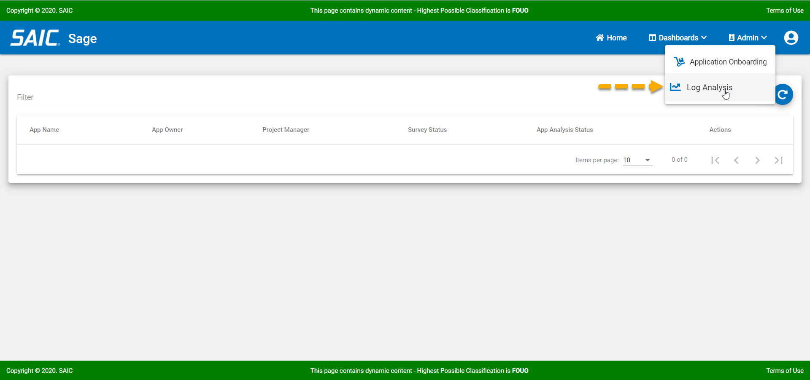

# Diagnostic Procedures

## Description of Error Processing

## Error Log Location

As an administrator there may be times when you need to examine the logs for possible assistance with an error. To view the logs, follow these steps:

**1. Log on to Sage with an administrator account and perform the step that is failing.**

**2. After the error has happened, select the Log Analysis Link located under the Admin drop down on the main menu bar.**

**3. Review and investigate the logs....**

_Show Log Window Here_

## Detail Corrections for Possible Issues

## Error Messages
